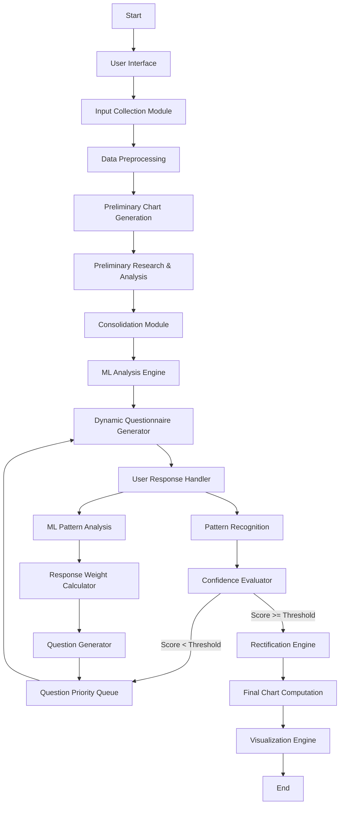

# Birth Time Rectifier Application Workflow

## Overview
This document outlines the end-to-end workflow of the Birth Time Rectifier application, implementing a two-phase approach that combines preliminary processing with comprehensive astrological analysis. The implementation must strictly follow the critical workflow diagram provided below.

## Implementation Phases

### Phase 1: Preliminary Processing
This phase handles initial data collection through preliminary analysis:

1. **User Interface & Input Collection**
   - Birth date (YYYY-MM-DD format)
   - Birth time (HH:mm format)
   - Birth place (City, Country)
   - Input source validation
   - Material-UI form components
   - Real-time validation
   - Error prevention

2. **Data Preprocessing**
   - Geocoding with multiple provider fallback
   - Timezone resolution with DST handling
   - Coordinate transformation
   - Data normalization
   - Error handling
   - Progress tracking

3. **Preliminary Chart Generation**
   - Swiss Ephemeris integration
   - Planetary position calculations
   - Divisional chart computation
   - Classical rule application
   - Chart visualization
   - Position validation

4. **Preliminary Research**
   - Event-based analysis with Dasha periods
   - Initial KP sub-lord analysis
   - Basic Tattwa Shodhana evaluation
   - Pattern recognition
   - Event correlation
   - Confidence scoring

5. **Data Consolidation**
   - Parameter merging
   - Preliminary validation
   - Dataset unification
   - Preparation for advanced analysis
   - Error checking
   - Data integrity verification

### Phase 2: Comprehensive Analysis
This phase handles advanced processing and final output:

1. **Advanced Analysis**
   - Fine-tuned divisional chart analysis
   - Precise KP sub-lord calculations
   - Complete Tattwa Shodhana analysis
   - AI-based optimization (Monte Carlo/regression)
   - Pattern matching
   - Event correlation
   - Confidence scoring

2. **Dynamic Questionnaire**
   - Real-time chart analysis
   - Case-specific question generation
   - Response processing
   - Pattern recognition
   - Confidence tracking
   - Event validation
   - User feedback loop

3. **Rectification Processing**
   - Birth time adjustment algorithms
   - Confidence scoring
   - Pattern matching
   - Result validation
   - Error estimation
   - Quality checks
   - Iteration control

4. **Final Output**
   - Updated chart computation
   - Visualization preparation
   - Result formatting
   - Data package generation
   - Export options
   - Documentation
   - User guidance

## Critical Implementation Diagram
IMPORTANT: This diagram represents the mandatory implementation workflow and must not be modified.



CRITICAL WORKFLOW DIAGRAM
=======================================

                        [User Interface]
                               │
                               ▼
                [Input Collection Module]
                (Birth Date, Time, Place)
                               │
                               ▼
                   [Data Preprocessing]
                • Geocoding the Place
                • Time Zone & Time Conversion
                               │
                               ▼
            [Preliminary Chart Generation]
        • Calculate Natal Chart using standard ephemeris libraries
        • Compute initial planetary positions and divisional charts
                               │
                               ▼
           [Preliminary Research & Analysis]
        • Apply event-based analysis (matching key life events with Dasha periods)
        • Run KP sub-lord analysis & Tattwa Shodhana for elemental evaluation
        • Generate a confidence score for the preliminary results
        • Present the confidence score in the UI/UX
                               │
                               ▼
                  [Consolidation Module]
            • Merge all computed parameters into a unified dataset
                               │
                               ▼
              [Output: Preliminary Data Package]
                               │
                               ▼
                 [Display Preliminary, preliminary Birth Charts, Planetary Positions & Divisional Charts]
                   [Style: Indian Vedic Astrology Chart]
                   [Confidence Score: 0-100%]
                               │
                               ▼
                [Comprehensive Analysis Module]
        • Advanced algorithms:
          - Fine-tuning via event-based divisional chart analysis
          - KP (Krishnamurti Paddhati) sub-lord precision
          - Tattwa Shodhana (elemental analysis)
          - Iterative AI optimization (e.g., Monte Carlo or regression-based refinement)
          - Updated confidence score based on the comprehensive results
          - Present the updated confidence score in the UI/UX
                               │
                               ▼
              [Dynamic Questionnaire Generator]
        • Analyze the detailed chart data in real time
        • Generate a case-specific, dynamic questionnaire (not static)
        • Present targeted questions (e.g., on key life events, physical traits, psychological patterns)
        • Present the questionnaire in a user-friendly, Yes/No format, multiple choice, or slider format
        • Present the questionnaire until the confidence score is above the threshold (>95%)
        • Present the confidence score in the UI/UX
                               │
                               ▼
                    [Machine Learning Module]
        • Advancced birth time rectification module to manage and govern the whole system end to end fixing erros and managing the workflow in real time using OpenAI API integration 
        • Use advanced machine learning algorithms to refine the birth time using 'gpt-4o' or other advanced reasoning models
        • Receive real-time responses from the user
        • Feed the answers into the AI Model and the rectification module to refine the birth time
        • Improve the questionnaire based on the responses to increase the confidence score
        • Present the updated confidence score in the UI/UX
        • Present the updated birth time in the UI/UX
        • Update the divisional and other key birth charts and planetary positions based on the updated birth time

                               │
                               ▼
          [Update Rectification Module & Update Chart Computation]
        • Based on the Machine Leaning Module Output, Update birth time, planetary positions, and divisional charts
        • Present the updated birth time in the UI/UX
                               │
                               ▼
              [Save the Refined Chart Data Package for future Machine Leaning Model Training]
                               │
                               ▼
                 [Display Corrected Results, Birth Charts, Planetary Positions & Divisional Charts]
                   [Style: Indian Vedic Astrology Chart]
                   
=======================================

## Technical Requirements

### Data Flow Requirements
```typescript
interface DataFlow {
    input: {
        birthData: BirthData;
        validations: ValidationRules;
    };
    processing: {
        preliminary: PreliminaryAnalysis;
        comprehensive: ComprehensiveAnalysis;
    };
    output: {
        rectification: RectificationResult;
        visualization: VisualizationData;
    };
}
```

### Security Requirements
- Input Sanitization
- API Security
- Data Privacy
- Result Integrity
- HTTPS
- Rate Limiting
- Error Handling
- Access Control

### Implementation Notes
1. The workflow must strictly follow the diagram sequence
2. No modifications to the core workflow are permitted
3. All components must implement specified interfaces
4. Performance requirements are mandatory
5. Security measures must be implemented at each step
6. Error handling must be comprehensive
7. Testing coverage must be maintained
8. Documentation must be kept updated
